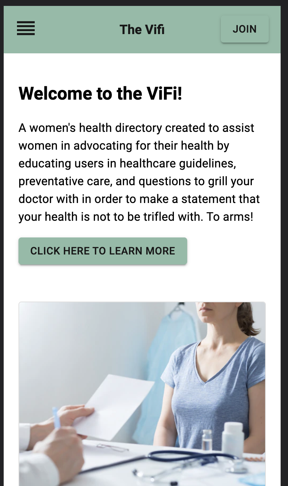
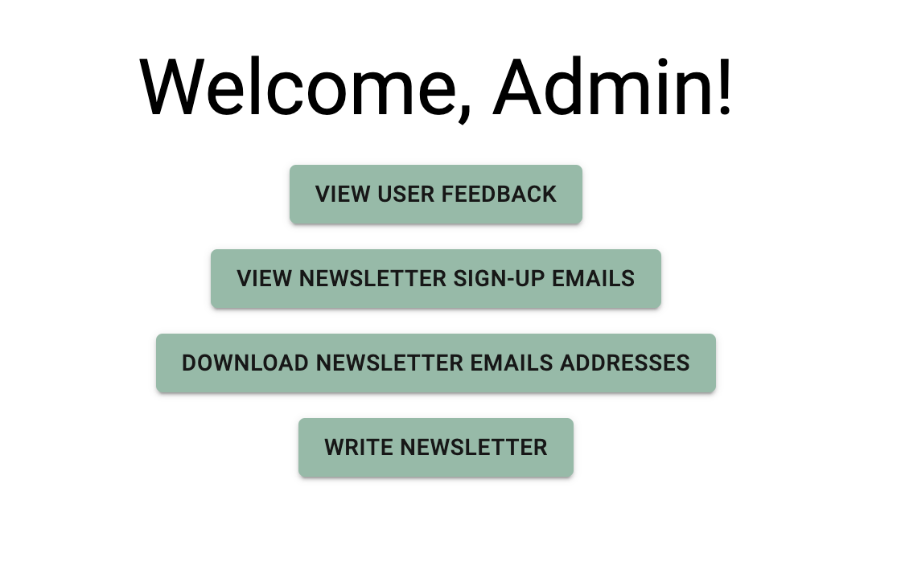
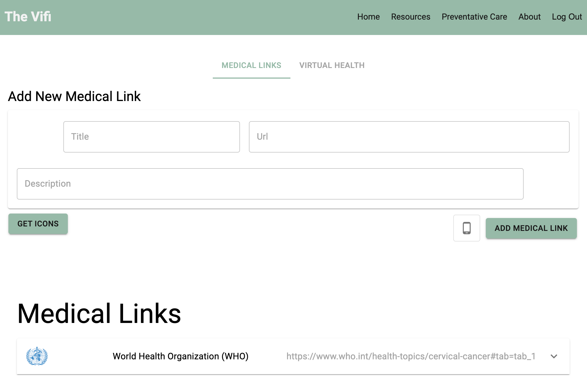
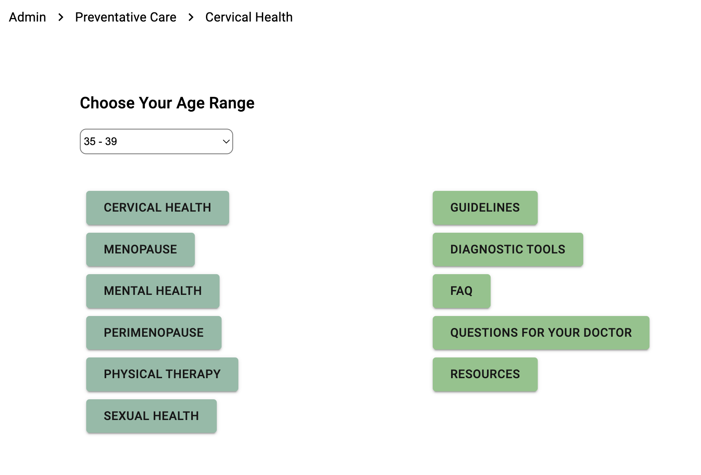

# The Vifi
## Womens Health Directory

## Description

_Duration: 2 Week Sprint_

The Vifi is our client Laina Latterner's solution to the challenges of women’s health. The goal of the app is to educate and support our targeted users, mainly women, with access to key info about health topics in easy, concise, and timely manner as well as preparation for doctor appointments so women can better advocate for themselves and feel more confident about their healthcare choices. As a mobile webapp, the ViFi is designed to be accessible anytime anywhere as an educative resource so women can take hold of their healthcare.

To see the fully functional site, please visit: [DEPLOYED VERSION OF APP](https://womens-health-app-vifi.herokuapp.com)

## Screen Shot

### Prerequisites

- [Node.js](https://nodejs.org/en/)
- [PostgreSQL](https://www.postgresql.org/) (For local use / demoing)

## Installation

### Local Use

1. Create a database named `womens_health_app` in PostgreSQL,
2. The queries in the `database.sql` file are set up to create all the necessary tables and populate the needed data to allow the application to run correctly. The project is built on [Postgres](https://www.postgresql.org/download/), so you will need to make sure to have that installed. We recommend using Postico to run those queries as that was used to create the queries, 
3. Open up your editor of choice and run an `npm install`
4. Run `npm run server` in your terminal
5. Run `npm run client` in your terminal
6. The `npm run client` command will open up a new browser tab for you!

### Deployed Domain

1. Create a database named `womens_health_app` in a PostgreSQL-based database
2. Import the queries in the `database.sql` file to your database (i.e. bit.io)
3. Create a .env file in the root folder and set a SERVER_SESSION_SECRET variable.
4. Set NODE_MAILER_USER and NODE_MAILER_USER_KEY variables.
5. If deploying to Heroku, set a DATABASE_URL variable in heroku config.
6. Deploy the webapp. The recommended domain is [heroku](www.heroku.com). 
7. Follow deploying steps given by the website including connections to your database
8. Go to the given URL of your domain!

## Usage
Watch this How To Video to learn how to use this app.

[How To Use The Vifi](https://www.youtube.com/watch?v=an4AMletbvU)

## Built With

JavaScript
React
Redux-Sagas
Express.js
Node.js
Axios
Material UI
Sweetalert2
Passport
Suneditor
Nodemailer
react-csv

## License
[MIT](https://choosealicense.com/licenses/mit/)

## Acknowledgement
Thanks to [Laina Latterner](https://www.linkedin.com/in/lainalatterner/) for allowing us an opportunity in creating an amazing webapp!
Thanks to [Prime Digital Academy](www.primeacademy.io) and [Edan Schwartz](https://www.linkedin.com/in/edanschwartz/) who equipped and helped us to make this application a reality.
Thanks to the Ramirez Cohort of Prime for your support and perserverance in the last 20 weeks. It has been a pleasure working together with everyone!
